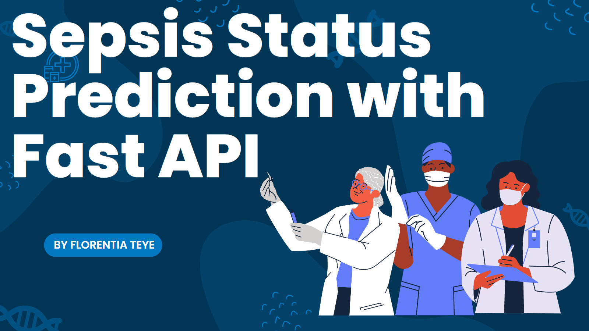
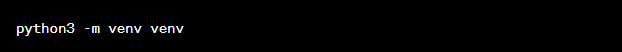
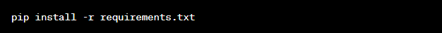

# **SEPSIS STATUS PREDICTION WITH FAST-API**
### Developing a machine learning API with fastAPI

Welcome to the Machine Learning API project! This repository showcases the development of a powerful and scalable machine learning API using FastAPI, a modern, fast (high-performance), web framework for building APIs with Python.

**Project Overview**

The goal of this project is to provide an efficient and user-friendly interface for leveraging  Machine Learning Model to Predict Sepsis Status. 

Machine learning allows the user to feed a computer algorithm an immense amount of data and have the computer analyze and make data-driven recommendations and decisions based on only the input data. In most of the situations we want to have a machine learning system to make predictions, so we have several categories of machine learning tasks depending on the type of prediction needed: Classification, Regression, Clustering, Generation, etc.

Classification is the task whose goal is the prediction of the label of the class to which the input belongs (e.g., Classification of images in two classes: cats and dogs). Regression is the task whose goal is the prediction of numerical value(s) related to the input (e.g., House rent prediction, Estimated time of arrival ). Generation is the task whose goal is the creation of something new related to the input (e.g., Text translation, Audio beat generation, Image denoising ). Clustering is the task of grouping a set of objects in such a way that objects in the same group (called a cluster) are more similar (in some sense) to each other than to those in other clusters (e.g., Clients clutering).

In machine learning, there are learning paradigms that relate to one aspect of the dataset: the presence of the label to be predicted. Supervised Learning is the paradigm of learning that is applied when the dataset has the label variables to be predicted, known as y variables. Unsupervised Learning is the paradigm of learning that is applied when the dataset has not the label variables to be predicted. Self-supervised Learning is the paradigm of learning that is applied when part of the X dataset is considere as the label to be predicted (e.g., the Dataset is made of texts and the model try to predict the next word of each sentence).

**Getting Started**

These instructions will help you get a copy of the project up and running on your local machine for development and testing purposes.

**Prerequisites**

Python 3.7 or higher
pip package manager

**Installation**

Create a virtual environment:

Activate the virtual environment:

Install the required dependencies:

**Usage**

Start the FastAPI development server:

Visit the Swagger UI documentation at http://localhost:8000/docs to explore and interact with the API.

Customize the API by adding your own machine learning models, business logic, and data preprocessing code to the appropriate modules.

Deploy the API to your preferred platform for production use.

Find below the link to a detailed article on the Sepsis Status Prediction with Fast API.
https://medium.com/@florentia.teye/sepsis-status-prediction-with-fast-api-bdb04bf01c76

Here is the link to the deployed app: https://huggingface.co/spaces/flokabukie/Sepsis-status-prediction-fast-api/tree/main
 
 ## Author
 Name: Florentia Teye

GitHub: [https://github.com/flokabukie)

LinkedIn: https://www.linkedin.com/in/florentia-teye-75270a191/

Email: florentiateye@gmail.com florentia.teye@azubiafrica.org

 

Florentia Teye is a Data Scientist with experience in data analysis and machine learning. She has a Bachelor's of Education degree in Mathematics and has worked on several open-source projects. In her free time, she enjoys teaching, researching new niches and writing. If you have any questions or suggestions, feel free to reach out to her on GitHub or LinkedIn.

